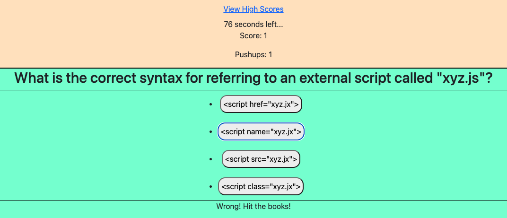

# 04 Web APIs: Code Quiz

# JavaScript-Quiz-Homework

## Your Task

At some point in your journey to become a full-stack web developer, you’ll likely be asked to complete a coding assessment&mdash;perhaps as part of an interview process. A typical coding assessment includes both multiple-choice questions and interactive coding challenges.

To help familiarize you with these tests and allow you to use the skills covered in this unit, this week’s homework invites you to build a timed coding quiz with multiple-choice questions. This app will run in the browser and will feature dynamically updated HTML and CSS powered by JavaScript code that you write. It will have a clean, polished, and responsive user interface.

This week’s coursework will equip you with all the skills you need to succeed in this assignment.

## User Story

```
AS A coding boot camp student
I WANT to take a timed quiz on JavaScript fundamentals that stores high scores
SO THAT I can gauge my progress compared to my peers
```

## Acceptance Criteria

```
GIVEN I am taking a code quiz

WHEN I click the start button
THEN a timer starts and I am presented with a question

WHEN I answer a question
THEN I am presented with another question

WHEN I answer a question incorrectly
THEN time is subtracted from the clock

WHEN all questions are answered or the timer reaches 0
THEN the game is over

WHEN the game is over
THEN I can save my initials and my score
```

## Mock-Up

The following animation demonstrates the application functionality:


## Description

First, I broke down the required sections and created the HTML structure for my page. I planned to hide irrelevent elements using JS, so the HTML has all sections on it.

After created all the JS element references required, I created an array to store my questions and answers. I decided to use an array of objects so I could call for certain key value pairs dynamically.

Next, I created event listeners and the functions I would need to trigger processes and navigate through my 1-page site. These functions include rendering certain elements dynamically, triggering the countdown timer, iterating through the question array to pull questions/answers, checking the correct/incorrect answer, and posted user inputs to local storage so I can post in a display.

Finally, I lightly styled the page to help with legibility.

## Deployment Details

Repo: [JavaScript Coding Quiz - Alex Geis Github](https://github.com/alexgeis/JavaScript-Quiz-Homework)

GitHub Pages URL: [JavaScript Coding Quiz](https://alexgeis.github.io/JavaScript-Quiz-Homework/)

Screenshot: 
